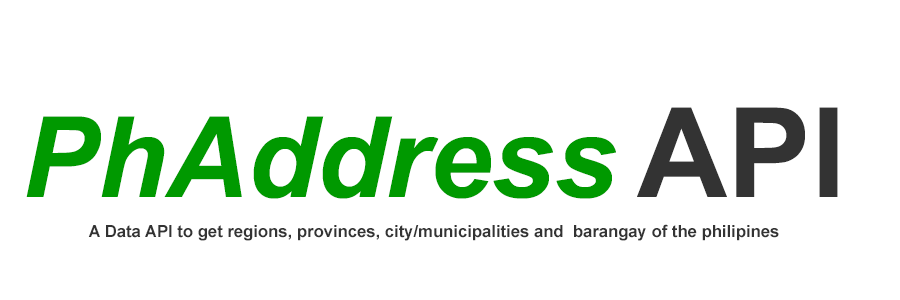

# ph-address-data
Data API of Regions,Provinces, CityMunicipalities, and Barangay of the Philippines

url: https://ph-address.onrender.com

- _**/ph/regions**_

  ### Route to get regions of the philippines

  PARAMETERS
    - empty = get all regions data
    - regCode = get region data filter by spefic region code

- _**/ph/provinces**_

  ### Route to get  provinces of the philippines

  PARAMETERS
    - empty = get all provinces data
    - regCode = filter by spefic region and its provinces
    - provCode = get province data filter by specific province code

- _**/ph/citymuns**_ 
  
  ### Route to get cities and municipalities of the philippines

  PARAMETERS
    - empty = get all citymun data
    - regCode = get get cities/municipalities data filter by spefic region code
    - provCode = get get cities/municipalities data filter by spefic provinces code
    - regCode && provCode = get cities/municipalities data filter by spefic region and provinces code

- _**/ph/barangays**_
  
  ### Route to get  barangays  of the philippines

  PARAMETERS
    - default = get all barangays data
    - regCode = get get barangays data filter by spefic region code
    - provCode = get get barangays data filter by spefic provinces code
    - regCode && provCode = get barangays data filter by spefic region and provinces code

    

## Contributing
How to Contribute to this Project Repository:
1. Fork the Project
2. Create your Branch 
3. Commit your Changes 
4. Push to the Branch 
5. Open a Pull Request

Thank you in advance for your contributions! Godbless and Happy Coding! 
